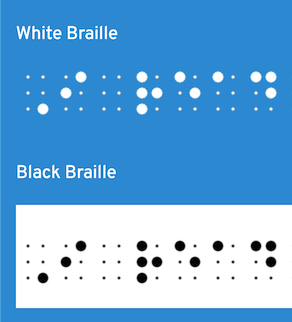

# Braille-Text

Simple Javascript and CSS to display Braille on web pages with hover effect for translation (for sighted people).

[Live demo](https://evoluteur.github.io/braille-text/index.html)


```js
const message = braille("I read Braille");
document.getElementById("braille").innerHTML = message;
```



The code is open source at [GitHub](https://github.com/evoluteur/braille-text).

More Javascript and CSS to display Braille at [Braille-Tools](https://evoluteur.github.io/braille-tools/index.html).

(c) 2024 Olivier Giulieri
