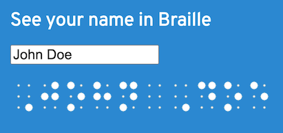

# Braille-Text

Simple Javascript and CSS to display Braille on web pages with hover effect for translation (for sighted people).

[Live demo](https://evoluteur.github.io/braille-text/index.html)



```js
const message = braille("I read Braille");
document.getElementById("braille").innerHTML = message;
```


(c) 2024 Olivier Giulieri
